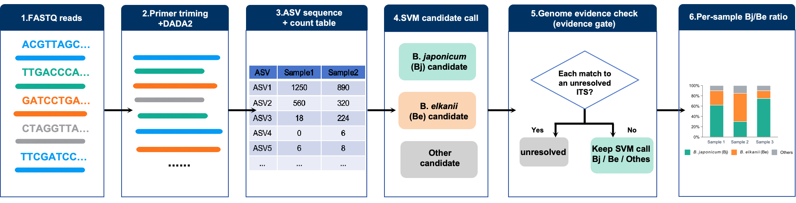

# BrayITS

A compact template for processing *Bradyrhizobium* ITS amplicons and summarizing *B. japonicum* (Bj) and *B. elkanii* (Be) reads in soybean nodule samples.



## What the diagram means

Paired-end FASTQ reads are primer-trimmed and denoised into ASV sequences plus an ASV-by-sample count table. A sequence classifier proposes Bj, Be, or Others for each ASV. Exact reference matches are then checked for label conflicts: a *Bradyrhizobium* sequence whose species is uncertain goes to **Others**, while a sequence whose genus is uncertain goes to **Unresolved**. Final ASV calls are joined to the count table to produce per-sample read counts.

Genome quality and ANI are **upstream reference-label checks**. The example classifier does not calculate ANI for a sample ASV. The genus check and exact-match override must be validated before using final Bj/Be/Others calls for phenotypes.

For the main three-part composition, use `Bj / (Bj + Be + Others)` and the analogous Be and Others fractions. **Others** includes any ASV supported as *Bradyrhizobium* but not reliably called Bj or Be, including named non-target species and genus-confirmed sequences without a species name. **Unresolved** means that *Bradyrhizobium* genus membership is not established; confirmed off-target sequences are tracked separately. Both are excluded from the three-part denominator but their read counts are reported for quality review. The separate `Bj / (Bj + Be)` measure answers only the Bj-versus-Be question. Set fractions to `NA` when their denominator is zero.

## Building the ITS reference

**Published starting point.** Teraishi et al. amplified a partial *Bradyrhizobium* 16S–23S ITS region. Their forward primer was designed in a conserved tRNA-Ala segment within ITS; the reverse primer used the ITS-R site near the 23S rRNA end. The exact assay primers and index design are given in their Supplementary Table S4 and Figure S5. This project uses that assay region as the target, so reference sequences and sample ASVs cover comparable bases.

**BrayITS adaptation.** The reference was rebuilt from genome assemblies rather than copied from the earlier RMOD reference:

1. Search NCBI for *Bradyrhizobium* assemblies across the genus, including named species and records labelled `sp.`. The project inventory contained 4,190 assembly records. Collapse corresponding GCA/GCF entries to 2,276 distinct assemblies.
2. Screen assembly quality using the reported CheckM completeness and contamination estimates. The strict candidate screen used completeness >=98% and contamination <=1%, leaving 936 genomes. Genomes outside this screen remain in a separate review pool; 936 is a genome count, not a count of ITS reference sequences.
3. Check provisional species names with whole-genome ANI against available type-material genome anchors, recording the closest and second-closest match, aligned fraction, and anchor quality. An ANI match is evidence for reviewing a genome label; a close match alone does not formally rename a strain or classify an ASV.
4. Locate the region bounded by the study primers in each candidate genome. Review genomes with no exact primer match for primer variants or incomplete assemblies. Trim the primers, keep provenance for every copy, and collapse identical ITS inserts. The v0.2 candidate catalog contains 307 distinct inserts from this screen; 306 A/C/G/T inserts were prepared for the QIIME 2 naive Bayes reference. These are candidate reference sequences, not 307 species or strains.
5. Review conflicting or uncertain labels before classifier training. A genus-confirmed insert without reliable Bj/Be support belongs to **Others**; genus-uncertain sequences remain **Unresolved**. Validate Bj/Be calls against independent genomes or mock communities before using them as phenotypes.

**Primer choice.** Use the published assay primers when reproducing the Teraishi amplicon. If a study uses different primers, rebuild the reference for that exact amplified region and check coverage and off-target amplification again. Primer sequences are intentionally supplied by the user rather than hard-coded in this template.

**Citation:** Teraishi M. et al. (2025). [Identification of Novel Candidate Genes Associated With the Symbiotic Compatibility of Soybean With Rhizobia Under Natural Conditions](https://doi.org/10.1002/pld3.70069). *Plant Direct* 9(5): e70069.

## Template scripts

The shell scripts in [`scripts/`](scripts/) show the QIIME 2 input and ASV stages. Replace the example manifest and primer placeholders with experiment-specific values. The scripts deliberately do not bundle reads, reference sequences, genome assemblies, trained models, or sample metadata.

```bash
export MANIFEST=/path/to/manifest.tsv
export FORWARD_PRIMER=YOUR_FORWARD_PRIMER
export REVERSE_PRIMER=YOUR_REVERSE_PRIMER
export OUTDIR=/path/to/output
bash scripts/01_asv_template.sh
bash scripts/02_export_asvs.sh
```

`manifest.tsv` must use QIIME 2's paired-end manifest format with `sample-id`, `forward-absolute-filepath`, and `reverse-absolute-filepath` columns. Check read quality and amplicon length before choosing DADA2 truncation values. The template uses zero truncation as a starting point, not as a universally recommended setting.

## Scope

This is a **workflow template**, not a released reference database or a validated classifier package. Species calls for a new study require a versioned ITS reference, independent strain or mock-community validation, and an explicit treatment of uncertain-genus and off-target reads. The diagram is conceptual: its “genome evidence check” refers to reference curation upstream of sample classification. An exact match to a species-uncertain but genus-confirmed reference belongs in Others, not Unresolved.
